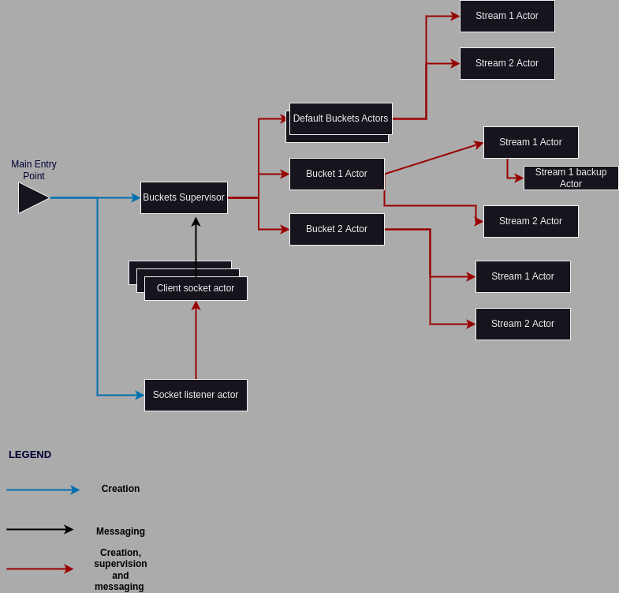

### Kahego - Kafka Helper in Go

A little tool made to help with messages batching sent to Kafka from applications that don't allow batching, like for example a PHP-FPM service.

It can be seen as an alternative to applications like the Kafka REST proxy and it fits in it's own niche. The issue with applications like Kafka Rest Proxy is the amount of resources it consumes and that it's a separate service, which will create latency and depending on the amount of messages generated for kafka a lot of extra costs due to having to create at least 1 new TCP connection for each request(in PHP-FPM).

This solution works as a service on the same host as the application that requires Kafka communication and it works as a UNIX socket, which is more efficient than creating TCP connections, even in localhost, and for some applications squeezing the most performance out of your servers. Maybe for other, less performance intensive applications, it lacks the flexibility that a HTTP service can offer like the Kafka REST.


#### 1. How to build?

Well, with golang 1.21.1 installed on your machine, do a 

```
$ go get
$ make build
```
This will create a dist folder which will contains all the necessary files:
* **dist/kahego** -> This is the executable file
* **dist/.env.dev.local** -> An environment variables file that will be loaded on start (dev is the default file that will be loaded unless other file is mentioned by using **environment** (literal) enviroment variable)
* **dist/buckets.json** -> A sample configuration file


#### 2. How to run?

* Define the sock file in the .env variable
* Define your buckets.json file(or call it as you wish and set it in the .env file) with your configuration
* Run kahego (probably as a service)

#### 3. Buckets file
```
{
    // STREAMS definition
    "streamsConfigs": {
        "kafka_01": { // id of the stream that will be used in bucket
            "type":"kafka", // type of the stream, kafka or file
            "slice": 1.0, // % of messages sent to stream, 1.0 = 100%
            "settings": { //custom settings for the stream type
                "bootstrap.servers": "kafka1:29092",
                "acks":"all",
                "compression.codec": "snappy",
                "batch.num.messages": "50000",
                "queue.buffering.max.messages": "500000",
                "queue.buffering.max.ms": "1000"
            },
            // backup stream in case primary fails
            "backup": { 
                "type":"file", //same as above, kafka or file
                // custom settings
                "settings": { 
                    "path":"/tmp/", //path were file will be saved
                    "maxFiles": "10", //max concurrent files
                    "sizeRotate": "10MB", //max file size 
                    "fileNameTemplate":"{bucket}/{ts}.bckstm" // file name template, can be used {bucket}, {ts} and {hostname}, if it contains "{PS}" it will create subdirectories where {PS} is path separator
                }
            }
        },
        "file_copy": { //another stream, just like the one above
            "type":"file",
            "slice":1.0,
            "settings":{
                "path":"/backup/",
                "maxFiles":"10",
                "sizeRotate":"100MB",
                "fileNameTemplate":"{bucket}{PS}{hostname}-{ts}.bckstm"
            }
        }
    },
    "buckets": [ // buckets definition, the id of the bucket is either the {bucket} in a filestream or the topic name in a kafka stream
        {
            "id": "requests",
            "streams": [ "kafka_01", "file_copy" ], //you can define multiple streams, it will duplicate messages between them
            "batch": 10000, //batch to be accumulated 
            "batchTimeout": 30000 //flush messages after this time in millis if no flush was made
        }
    ],
    //same as above, but in this case it will take the bucket defined in the message sent, not the id, yet id is still required due to how configuration deserialization works
    "defaultBucket": {
        "id":"default",
        "streams": ["kafka_01"],
        "batch":1000,
        "batchTimeout": 30000
    } 
}
```
File stream type accept the following placeholders for fileNameTemplate:

* {bucket} -> Bucket name
* {PS} -> Path separator, for example on Linux is "/" (without quotes)
* {hostname} -> Machine hostname value
* {rand} -> random 8 alphanumeric characters value
* {ts} -> current timestamp in seconds

Keep in mind that batch and batchTimeout have little effect on kafka streams due to being controlled by kafka configuration, to be more precise
```
    "batch.num.messages": "50000", // batch size
    "queue.buffering.max.messages": "500000",  //max messages stored in buffer
    "queue.buffering.max.ms": "1000" //batch send every x ms
```
#### 4. Message serialization

The message is serialized in the next way:
```
(1_byte_len_bucket_name) + (bucket_name_bytes) + (1_byte_len_message_key) + (message_key_bytes) + (message_bytes)
```
Bucket name and message are required, but the message key can be empty, that means, you can set the message_key len to 0 and just not send the message key. 


As you can see neither the bucket_name or the message_key can exceed 255 bytes since their length definition is only 1 byte.

You can see an example in the test.php under clients folder. 


#### 5. Code architecture

Code is structured under a custom made actor system that allows for paralelization and concurrent execution of all the required work, like listening to new clients, dealing with each connected client, batching the messages, writing to files or kafka etc...



#### 6. Contributing
If you'd like to contribute to Kahego, you can fork the repository and submit a pull request. contributions are welcome, whether they are bug fixes, improvements to the code, or new features.
